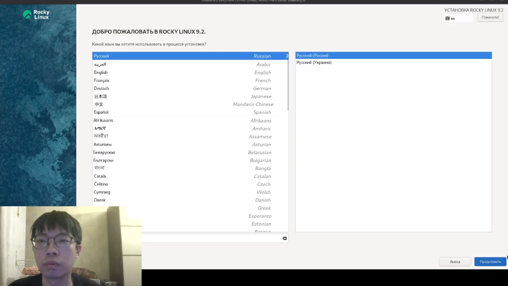
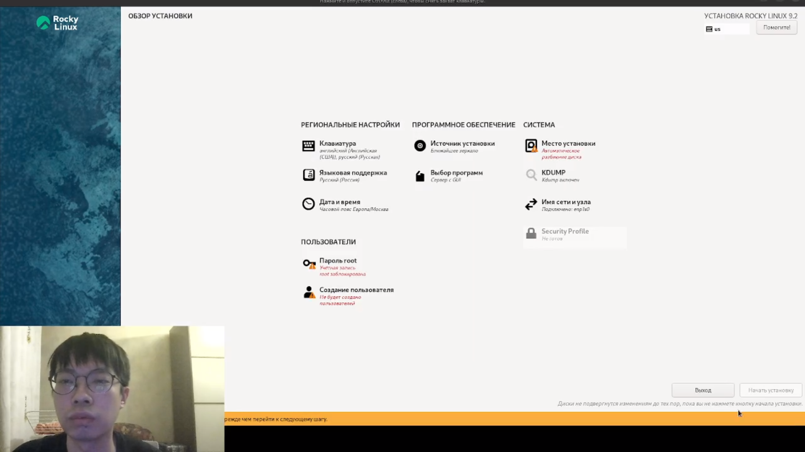
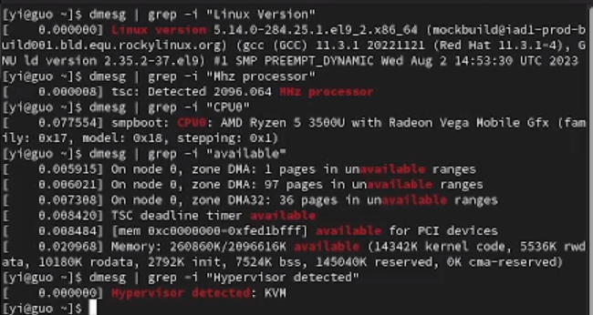
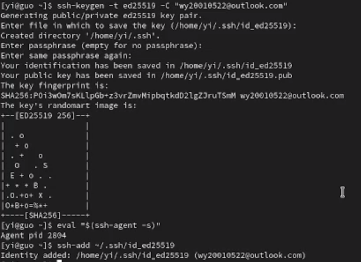
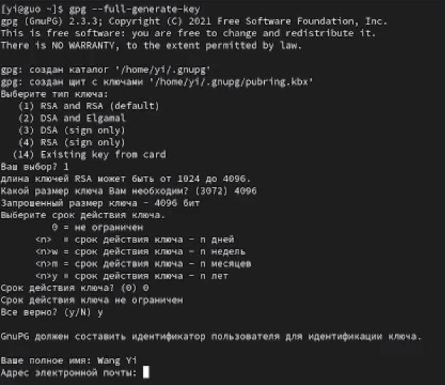
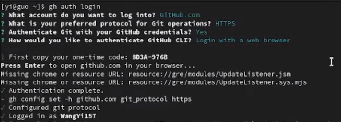
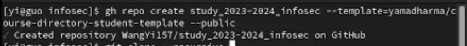
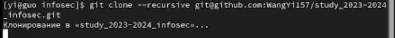
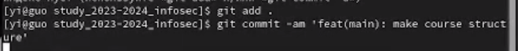

---
## Front matter
title: "Лабораторная работа № 1"
subtitle: "Установка и конфигурация
операционной системы на виртуальную машину и подготовка репозитория"
author: "Ван И"

## Generic otions
lang: ru-RU
toc-title: "Содержание"

## Bibliography
bibliography: bib/cite.bib
csl: pandoc/csl/gost-r-7-0-5-2008-numeric.csl

## Pdf output format
toc: true # Table of contents
toc-depth: 2
lof: true # List of figures
lot: false
fontsize: 12pt
linestretch: 1.5
papersize: a4
documentclass: scrreprt
## I18n polyglossia
polyglossia-lang:
  name: russian
  options:
	- spelling=modern
	- babelshorthands=true
polyglossia-otherlangs:
  name: english
## I18n babel
babel-lang: russian
babel-otherlangs: english
## Fonts
mainfont: PT Serif
romanfont: PT Serif
sansfont: PT Sans
monofont: PT Mono
mainfontoptions: Ligatures=TeX
romanfontoptions: Ligatures=TeX
sansfontoptions: Ligatures=TeX,Scale=MatchLowercase
monofontoptions: Scale=MatchLowercase,Scale=0.9
## Biblatex
biblatex: true
biblio-style: "gost-numeric"
biblatexoptions:
  - parentracker=true
  - backend=biber
  - hyperref=auto
  - language=auto
  - autolang=other*
  - citestyle=gost-numeric
## Pandoc-crossref LaTeX customization
figureTitle: "Рис."
tableTitle: "Таблица"
listingTitle: "Листинг"
lofTitle: "Список иллюстраций"
lotTitle: "Список таблиц"
lolTitle: "Листинги"
## Misc options
indent: true
header-includes:
  - \usepackage{indentfirst}
  - \usepackage{float} # keep figures where there are in the text
  - \floatplacement{figure}{H} # keep figures where there are in the text
---

# Цель работы

Целью данной работы является приобретение практических навыков установки операционной системы на виртуальную машину, настройки минимально необходимых для дальнейшей работы сервисов, а также изучение средств контроля версий и получение навыков работы с git.

# Задание

1. Установить и настроить ОС Linux на виртуальную машину.

2. Подготовить репозиторий для дальнейшей работы.

# Теоретическое введение

- Операционная система (ОС) – это комплекс программ, предназначенных для управления ресурсами компьютера и организации взаимодействия с пользователем [1].

- Система контроля версий — это система, записывающая изменения в файл или набор файлов в течение времени и позволяющая вернуться позже к определённой версии [2].

# Выполнение лабораторной работы

1. Создадим виртуальную машину (@fig:001).

{#fig:001 width=90%}

1. Запустим виртуальную машину и дождемся загрузки ОС. После этого проведем первичную настройку системы (@fig:002).

{#fig:002 width=90%}

3. После запуска ОС откроем терминал и выведем некоторую информацию о нашей конфигурации (@fig:003).

{#fig:003 width=90%}

4. Проведем базовую настройку git (@fig:004).

{#fig:004 width=90%}

5. Создадим SSH-ключ по по алгоритму ed25519 (@fig:005).

{#fig:005 width=90%}

6. Создадим ключ GPG и добавим его в GitHub (@fig:006).

{#fig:006 width=90%}

7. Настроим автоматические подписи коммитов git (@fig:007).

{#fig:007 width=90%}

8. Авторизуемся на Github с помощью gh (@fig:008).

{#fig:008 width=90%}

9. Создадим репозиторий на основе данного шаблона и склонируем его на локальную машину (@fig:009 - @fig:010).

{#fig:009 width=90%}

{#fig:010 width=90%}

10.  Настроим каталог курса и создадим коммит. Затем отправим изменения на сервер (@fig:011).

{#fig:011 width=90%}

# Выводы

Были приобретены практические навыки установки операционной системы на виртуальную машину, настройки минимально необходимых для дальнейшей работы сервисов, а также изучены средства контроля версий и получены навыки работы с git.

# Список литературы{.unnumbered}

[1] https://softline.tm/solutions/programmnoe-obespechenie/operating-system

[2] https://git-scm.com/book/ru/v2/%D0%92%D0%B2%D0%B5%D0%B4%D0%B5%D0%BD%D0%B8%D0%B5-%D0%9E-%D1%81%D0%B8%D1%81%D1%82%D0%B5%D0%BC%D0%B5-%D0%BA%D0%BE%D0%BD%D1%82%D1%80%D0%BE%D0%BB%D1%8F-%D0%B2%D0%B5%D1%80%D1%81%D0%B8%D0%B9

