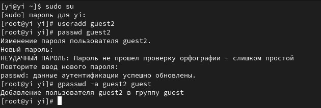
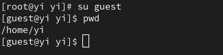
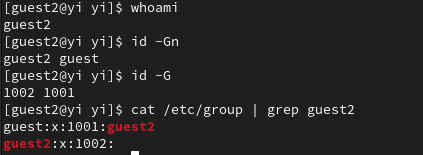
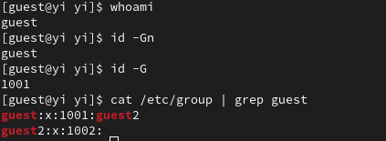
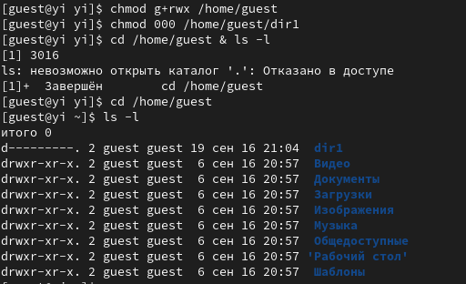
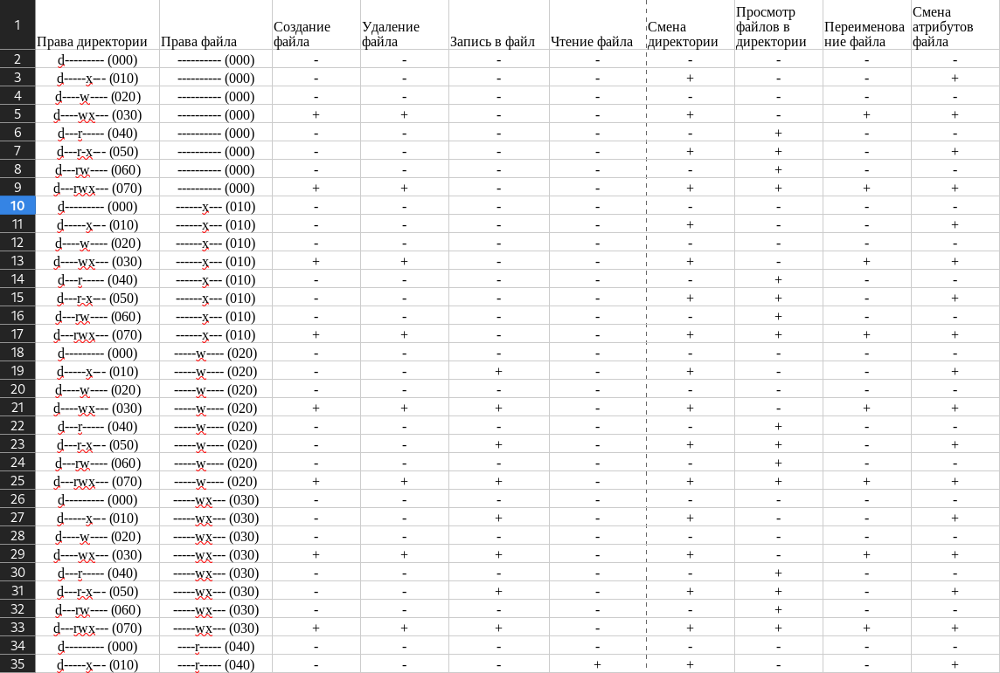
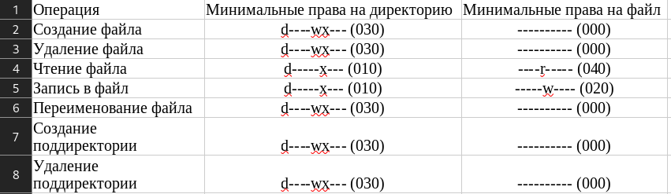

---
## Front matter
title: "Отчет по лабораторной работе №3"
subtitle: "по дисциплине: Информационная безопасность"
author: "Ван И"

## Generic otions
lang: ru-RU
toc-title: "Содержание"

## Bibliography
bibliography: bib/cite.bib
csl: pandoc/csl/gost-r-7-0-5-2008-numeric.csl

## Pdf output format
toc: true # Table of contents
toc-depth: 2
lof: true # List of figures
lot: false # List of tables
fontsize: 12pt
linestretch: 1.5
papersize: a4
documentclass: scrreprt
## I18n polyglossia
polyglossia-lang:
  name: russian
  options:
	- spelling=modern
	- babelshorthands=true
polyglossia-otherlangs:
  name: english
## I18n babel
babel-lang: russian
babel-otherlangs: english
## Fonts
mainfont: PT Serif
romanfont: PT Serif
sansfont: PT Sans
monofont: PT Mono
mainfontoptions: Ligatures=TeX
romanfontoptions: Ligatures=TeX
sansfontoptions: Ligatures=TeX,Scale=MatchLowercase
monofontoptions: Scale=MatchLowercase,Scale=0.9
## Biblatex
biblatex: true
biblio-style: "gost-numeric"
biblatexoptions:
  - parentracker=true
  - backend=biber
  - hyperref=auto
  - language=auto
  - autolang=other*
  - citestyle=gost-numeric
## Pandoc-crossref LaTeX customization
figureTitle: "Рис."
tableTitle: "Таблица"
listingTitle: "Листинг"
lofTitle: "Список иллюстраций"
lotTitle: "Список таблиц"
lolTitle: "Листинги"
## Misc options
indent: true
header-includes:
  - \usepackage{indentfirst}
  - \usepackage{float} # keep figures where there are in the text
  - \floatplacement{figure}{H} # keep figures where there are in the text
---

# Цели работы

Получение практических навыков работы в консоли с атрибутами файлов, закрепление теоретических основ дискреционного разграничения доступа в современных системах с открытым кодом на базе ОС Linux.

# Задание

1. Создать новую учетную запись guest2.

2. Выполнить ряд операций в новой учетной записи.

3. Сформировать таблицу "Установленные права и разрешенные действия".

4. Сформировать таблицу "Минимальные права для совершения операций".

# Теоретическое введение

- Операционная система — это комплекс программ, предназначенных для управления ресурсами компьютера и организации взаимодействия с пользователем [@system].

- Права доступа определяют, какие действия конкретный пользователь может или не может совершать с определенным файлами и каталогами. С помощью разрешений можно создать надежную среду — такую, в которой никто не может поменять содержимое ваших документов или повредить системные файлы. [@root].

# Выполнение лабораторной работы

1. Создадим учетную запись пользователя guest2, зададим пароль, и добавим пользователя guest2 в группу guest (@fig:001).

{#fig:001 width=90%}

2. Осуществим вход в систему от двух пользователей на двух разных консолях. Для обоих пользователей командой pwd определим директорию, в которой мы находимся. Видим, что приглашение в командной строке соответствует (@fig:002, @fig:003).

{#fig:002 width=90%}

{#fig:003 width=90%}

3. Уточним имя пользователя, его группу, кто входит в неё и к каким группам принадлежит он сам. Сравним полученную информацию с содержимым файла /etc/group (@fig:004, @fig:005).

{#fig:004 width=90%}

{#fig:005 width=90%}

4. От имени пользователя guest2 выполним регистрацию пользователя guest2 в группе guest. От имени пользователя guest изменим права директории /home/guest, разрешив все действия для пользователей группы. От имени пользователя guest снимем с директории /home/guest/dir1 все атрибуты. (@fig:006)

{#fig:006 width=90%}

5. Заполним таблицу «Установленные права и разрешённые действия» (@fig:007, @fig:008).

{#fig:007 width=90%}

{#fig:008 width=90%}

6. Заполним таблицу «Минимальные права для совершения операций» (@fig:009).

{#fig:009 width=90%}

# Выводы

В ходе лабораторной работы нам удалось:

Получить практические навыки работы в консоли с атрибутами файлов, закрепить теоретические основы дискреционного разграничения доступа в современных системах с открытым кодом на базе ОС Linux.

# Список литературы

::: {#refs}
:::
