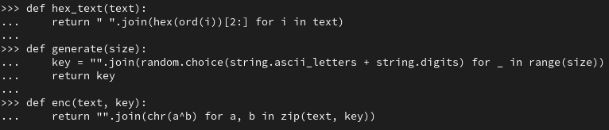
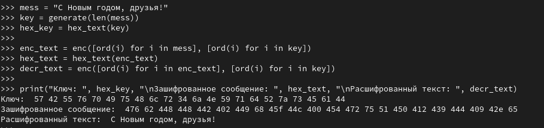
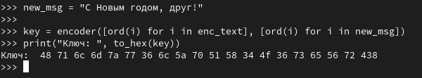

---
## Front matter
lang: ru-RU
title: Лабораторная работа №7
subtitle: Элементы криптографии. Однократное гаммирование
author:
  - Ван И
institute:
  - Российский университет дружбы народов, Москва, Россия
date: 21 октября 2023

## i18n babel
babel-lang: russian
babel-otherlangs: english

## Formatting pdf
toc: false
toc-title: Содержание
slide_level: 2
aspectratio: 169
section-titles: true
theme: metropolis
header-includes:
 - \metroset{progressbar=frametitle,sectionpage=progressbar,numbering=fraction}
 - '\makeatletter'
 - '\beamer@ignorenonframefalse'
 - '\makeatother'
---

# Информация

## Докладчик

:::::::::::::: {.columns align=center}
::: {.column width="70%"}

  * Ван И
  * студент НФИбд-02-20
  * Российский университет дружбы народов
  * [1032198069@pfur.ru](mailto:1032198069@pfur.ru)
  * <https://github.com/WangYi157>

:::
::::::::::::::

# Вводная часть

## Объект и предмет исследования

- Атрибуты файлов
- Дистрибутив Rocky
- Дискреционное разграничение доступа

## Цели

Освоить на практике применение режима однократного гаммирования

## Выполнение работы

  Импортируем необходимые модули (@fig:001).

  {#fig:001 width=90%}

## Выполнение работы

Создадим функции для преобразования данных в шестнадцатеричный формат, генерации ключа и кодирования, декодирования данных (@fig:002).

{#fig:002 width=90%}

## Выполнение работы

Закодируем и декодируем строку "С Новым годом, друзья!" (@fig:003).

{#fig:003 width=90%}

## Выполнение работы

Получим ключ, с помощью которого получим сообщения "С Новым годом, друг" вместо "С Новым годом, друзья!" при декодировании. Воспользуемся симметричностью кодирования(@fig:004).

{#fig:004 width=90%}

## Вывод

В рамках данной лабораторной работы было освоено на практике применение режима однократного гаммирования

